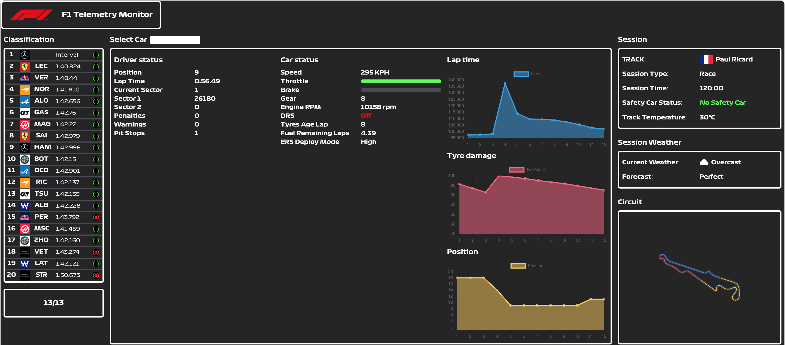

# F1 Metrics 📈
---
The best free and open-source app to track your F1 game metrics.

## Current Features 👀
---
Here you can find a detailed list of every feature of the current version:

✅ **Car Telemetry**
> Shows a lot of information about the selected car. Information can be broken into the following categories (Currently offline):
> * 🙋🏻‍♂️ Driver Status 
> * 🏎 Car Status
> * 📊 Plots
> * 🚨 Car Damage 

✅ **Classification Ranking**
> Shows the current position of every driver in the game, its team logo, driver's abbreviation, last lap time and current tyre compound. (Currently offline)

✅ **Session Lap/Time Tracker**
> Shows the current lap and the total laps of the race or the time left of the session on qualifying or practice sessions. (Currently offline)

✅ **Session Information**
> Shows the track with the country flag, the session type, time left, Safety Car status and track temperature. (Currently online)

✅ **Weather Conditions**
> Shows the current weather and forecast accuracy. (Currently online)

✅ **Circuit Image**
> Shows the image of the current circuit. (Not available on every tracks)

## Coming soon ⏱
---

💻 **Native Version** 
> The current version is web-based, so in order to make it more usable I will create a electron-based app to run the app locally.

⚔️ **Rivalry Metrics**
> To become a better driver you need rivals, and being able to add rivals to the comparison charts is the best way to visualise a victory.

🌍 **Go Online!**
> Tune the software to use all the features in online mode.

## About the creator 🙋🏻‍♂️
---
Hi everyone! I'm Guillem and I have been working in this project for a month and I hope this application can be useful to improve or at least entertain you and you will have a good time.

Special thanks to [PrimeGoose](https://github.com/PrimeGoose) for creating the packet and making this project possible.

If you like this job and you find it useful, please leave a ⭐️ or share it via social media.

Thank you so much to everyone! ❤️

🌍 [My Website](https://www.guillemgarcia.dev)  
🤵🏻 [My Linkedin](https://www.linkedin.com/in/guillem-garc%C3%ADa-gil-8478051b2/)  
🐦 [My Twitter](https://twitter.com/williamhartz_)   